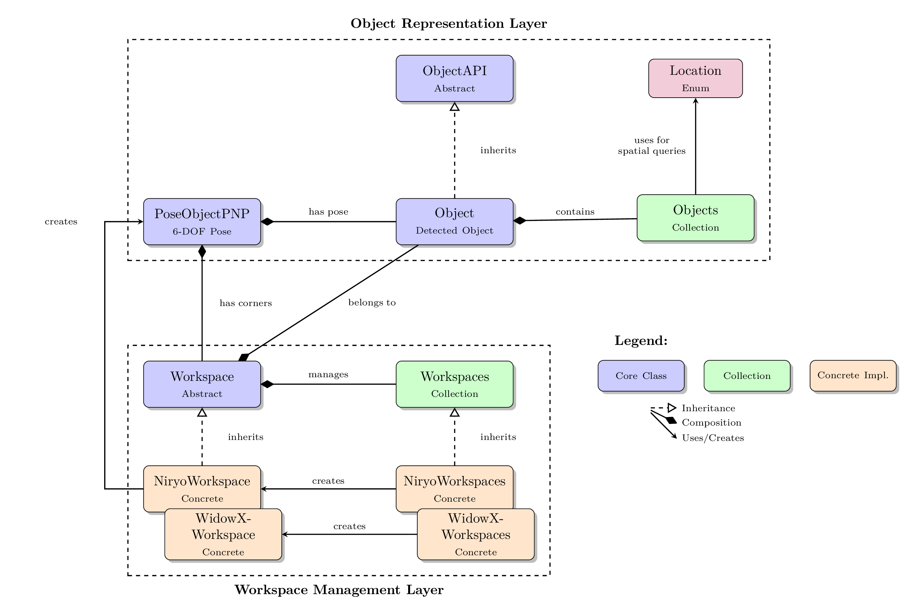

# Robot Workspace

[](https://github.com/dgaida/robot_workspace)
[](https://www.python.org/downloads/)
[](https://opensource.org/licenses/MIT)
[](https://codecov.io/gh/dgaida/robot_workspace)
[](https://github.com/dgaida/robot_workspace/actions/workflows/lint.yml)
[](https://github.com/dgaida/robot_workspace/actions/workflows/tests.yml)
[](https://github.com/dgaida/robot_workspace/actions/workflows/codeql.yml)
[](https://github.com/psf/black)
[](https://github.com/astral-sh/ruff)

A Python framework that bridges the gap between camera images and physical robot manipulation. It provides the essential data structures and coordinate transformations needed to convert detected objects from vision systems into actionable pick-and-place targets for robotic arms. The framework handles workspace calibration, object representation with physical properties, and spatial reasoning—enabling vision-equipped robots to understand "where" objects are and "how" to grasp them in real-world coordinates.

---

## 🎯 Overview

The `robot_workspace` package provides a complete framework for managing robotic workspaces, including:

- **🎯 Coordinate Transformations**: Seamlessly transform between camera and world coordinate frames
- **📦 Object Representation**: Rich object models with position, dimensions, segmentation masks, and orientation
- **🗺️ Workspace Management**: Define and manage multiple workspaces with different configurations
- **🔍 Spatial Queries**: Find objects by location, size, proximity, or custom criteria
- **💾 Serialization**: JSON-based serialization for data persistence and communication
- **🤖 Robot Support**: Native support for Niryo Ned2 and WidowX 250 6DOF robots (real and simulation, extensible to other platforms)

---

## ✨ Key Features

### Vision & Detection
- Integrate object detection with bounding boxes, segmentation masks, and physical properties
- Calculate center of mass and optimal gripper orientations
- Support for multi-object tracking and management

### Coordinate Systems
- Transform between relative image coordinates (0-1) and world coordinates (meters)
- Handle multiple workspace configurations with different camera poses
- Automatic workspace boundary detection

### Spatial Reasoning
- Query objects by spatial relationships (left/right/above/below/close to)
- Find nearest objects to specified coordinates
- Filter by size, label, or custom criteria

### LLM Integration
- Generate natural language descriptions of objects and scenes
- Structured output formats for AI agent integration
- Easy-to-parse object properties

### Quality Assurance
- >90% test coverage with comprehensive unit and integration tests
- Full type annotations for better IDE support
- Extensive documentation and examples

---

## 📋 Table of Contents

- [Architecture](#-architecture)
- [Installation](#-installation)
- [Quick Start](#-quick-start)
- [Examples](#-examples)
- [Documentation](#-documentation)
- [Testing](#-testing)
- [Adding Robot Support](#-adding-robot-support)
- [Development](#-development)
- [Contributing](#-contributing)
- [License](#-license)
- [Citation](#-citation)

---

## 🏗️ Architecture

### Core Components

```
robot_workspace/
├── objects/                   # Object detection and representation
│   ├── object.py              # Single object with properties and methods
│   ├── objects.py             # Collection of objects with spatial queries
│   ├── object_api.py          # API interface for objects
│   └── pose_object.py         # 6-DOF pose representation (x, y, z, roll, pitch, yaw)
├── workspaces/                # Workspace definitions and management
│   ├── workspace.py           # Abstract workspace base class
│   ├── workspaces.py          # Collection of workspaces
│   ├── niryo_workspace.py     # Niryo Ned2 workspace implementation
│   ├── niryo_workspaces.py    # Niryo workspace collection
│   ├── widowx_workspace.py    # WidowX 250 6DOF implementation
│   └── widowx_workspaces.py   # WidowX workspace collection
└── common/                    # Utilities
    └── logger.py              # Logging decorators
```

### Architecture Diagram



### Coordinate Systems

The package handles three coordinate systems:

1. **Image Coordinates (Pixels)**: Raw camera pixel coordinates
2. **Relative Coordinates (0-1)**: Normalized workspace-independent coordinates
3. **World Coordinates (Meters)**: Robot base frame coordinates

```
Image (u, v) → Relative (u_rel, v_rel) → World (x, y, z) + Orientation
```

For detailed information, see [Architecture Documentation](docs/README.md).

---

## 📦 Installation

### Prerequisites

- Python 3.9 or higher
- pip package manager

### Basic Installation

```bash
# Clone the repository
git clone https://github.com/dgaida/robot_workspace.git
cd robot_workspace

# Install in development mode
pip install -e .
```

### With Robot Support

```bash
# Niryo Ned2 support
pip install -e ".[niryo]"

# All features
pip install -e ".[all]"
```

### Development Installation

```bash
pip install -e ".[dev]"
```

This installs additional development tools:
- pytest and pytest-cov for testing
- black for code formatting
- ruff for linting
- mypy for type checking
- pre-commit hooks

---

## 🚀 Quick Start

### Core Concepts

The repository provides three main capabilities:

1. **Pose Representation** - 6-DOF poses (position + orientation) for objects and robot targets
2. **Object Management** - Detected objects with physical properties, positions, and spatial queries
3. **Coordinate Transformation** - Convert camera coordinates to robot world coordinates

### Essential Usage
```python
from robot_workspace import PoseObjectPNP, Object, Objects, NiryoWorkspaces
from unittest.mock import Mock

# 1. Working with Poses (position + orientation)
pose = PoseObjectPNP(x=0.2, y=0.1, z=0.05, roll=0.0, pitch=1.57, yaw=0.0)
print(f"Position: [{pose.x}, {pose.y}, {pose.z}]")

# Add offsets to create new poses
pick_pose = pose.copy_with_offsets(z_offset=-0.02)  # Lower gripper 2cm

# 2. Representing Detected Objects
# Objects are created from vision system detections with bounding boxes
obj = Object(
    label="pencil",
    u_min=100, v_min=100, u_max=200, v_max=200,  # Bounding box in pixels
    mask_8u=None,  # Optional segmentation mask
    workspace=workspace  # Links to workspace for coordinate transforms
)

# Access object properties in physical units
print(f"Object '{obj.label()}' at [{obj.x_com():.2f}, {obj.y_com():.2f}] meters")
print(f"Size: {obj.width_m():.3f}m × {obj.height_m():.3f}m = {obj.size_m2()*10000:.1f} cm²")
print(f"Optimal grasp angle: {obj.gripper_rotation():.2f} radians")

# 3. Spatial Queries with Object Collections
objects = Objects([obj1, obj2, obj3])

# Find objects by spatial relationships
from robot_workspace import Location
left_objects = objects.get_detected_objects(
    location=Location.LEFT_NEXT_TO,
    coordinate=[0.2, 0.0]
)

# Find nearest object to a coordinate
nearest, distance = objects.get_nearest_detected_object([0.25, 0.05])
print(f"Nearest: {nearest.label()} at {distance*100:.1f}cm away")

# Size-based queries
largest, size = objects.get_largest_detected_object()
sorted_by_size = objects.get_detected_objects_sorted(ascending=True)

# 4. Coordinate Transformation (requires robot environment)
# Transform camera image coordinates to robot world coordinates
world_pose = workspace.transform_camera2world_coords(
    workspace_id="niryo_ws",
    u_rel=0.5,  # Center of image (normalized 0-1)
    v_rel=0.5,
    yaw=0.0     # Object orientation
)
print(f"Image center → World: [{world_pose.x:.2f}, {world_pose.y:.2f}, {world_pose.z:.2f}]")
```

### Integration with Vision System

This framework integrates seamlessly with the vision detection pipeline:
```python
# Typical workflow:
# 1. vision_detect_segment detects objects in camera image
# 2. robot_workspace converts detections to Object instances with world coordinates  
# 3. robot_environment uses Objects for pick-and-place planning
# 4. robot_mcp enables natural language control: "pick up the pencil"

# The Object class bridges vision and manipulation:
detected_objects = cortex.get_detected_objects()  # From vision system
objects = Objects([
    Object(..., workspace=workspace) for detection in detected_objects
])
robot.pick_object(objects[0].label(), objects[0].coordinate())
```

---

## 📚 Examples

### Running the Demo

The package includes a comprehensive demonstration script that uses mocked components:

```bash
python main.py
```

This demonstrates:
- Pose object creation and manipulation
- Workspace management (with mock environment)
- Object creation and properties
- Spatial queries and filtering
- Serialization and deserialization
- LLM-friendly formatting

**No robot hardware required for the demo!**

### More Examples

See [examples.md](docs/examples.md) for detailed usage examples including:
- Object detection workflows
- Multi-workspace management
- Serialization patterns
- Integration with robot controllers

---

## 📖 Documentation

### API Reference
- [API Documentation](docs/api.md) - Complete API reference
- [Architecture Documentation](docs/README.md) - System design and patterns
- [Examples](docs/examples.md) - Usage examples and recipes

### Key Classes

- **PoseObjectPNP**: 6-DOF pose with position and orientation
- **Object**: Detected object with physical properties
- **Objects**: Collection with spatial query capabilities
- **Workspace**: Abstract workspace base class
- **NiryoWorkspace**: Niryo Ned2 implementation
- **WidowXWorkspace**: WidowX 250 6DOF implementation

---

## 🧪 Testing

See [docs/TESTING.md](docs/TESTING.md) and [tests/README.md](tests/README.md) for detailed testing documentation.

---

## 🔧 Adding Robot Support

See [docs/adding_robot_support.md](docs/adding_robot_support.md) for detailed guidelines.

---

## 💻 Development

### Code Quality Tools

This project uses:
- **Black** for code formatting (line length: 127)
- **Ruff** for fast Python linting
- **mypy** for type checking
- **pre-commit** hooks for automated checks

### Setup Pre-commit Hooks

```bash
pre-commit install
```

### Manual Code Quality Checks

```bash
# Format code
black .

# Lint code
ruff check .

# Type check
mypy robot_workspace --ignore-missing-imports
```

### Project Structure

```
robot_workspace/
├── .github/workflows/      # CI/CD workflows
├── docs/                   # Documentation
├── robot_workspace/        # Source code
├── tests/                  # Test suite
├── main.py                 # Demo script
├── pyproject.toml         # Project configuration
├── requirements.txt       # Dependencies
└── README.md              # This file
```

---

## 🤝 Contributing

See [CONTRIBUTING.md](CONTRIBUTING.md) for detailed guidelines.

---

## 📄 License

MIT License - see [LICENSE](LICENSE) file for details.

---

## 📝 Citation

If you use this package in your research, please cite:

```bibtex
@software{robot_workspace,
  author = {Gaida, Daniel},
  title = {Robot Workspace: A Framework for Robotic Workspace Management},
  year = {2025},
  url = {https://github.com/dgaida/robot_workspace}
}
```

---

## 📞 Support

- **Issues**: [GitHub Issues](https://github.com/dgaida/robot_workspace/issues)
- **Documentation**: See [docs/](docs/) directory
- **Examples**: Run `python main.py` for demonstrations
- **Email**: daniel.gaida@th-koeln.de

---

## 🙏 Acknowledgments

- Built for the Niryo Ned2 and WidowX 250 6DOF robotic platforms
- Designed for integration with computer vision systems
- Supports both real robots and Gazebo simulation
- Mock environment enables hardware-free development and testing

---

## 🗺️ Roadmap

- [ ] Additional robot platform support
- [ ] Enhanced multi-workspace coordination
  - Automatic object handoff between workspaces
  - Synchronized multi-workspace scanning
  - Cross-workspace object tracking and state management
  - Collision-free multi-arm coordination
  - Shared memory pools for collaborative tasks
  - Priority-based workspace arbitration
- [ ] Integration with popular ML frameworks
- [ ] ROS2 compatibility layer
- [ ] Web-based visualization tools

---

## 🔗 Related Projects

This package is part of a larger ecosystem for robotic manipulation and AI-driven control:

- **[robot_environment](https://github.com/dgaida/robot_environment)** - Complete robot control framework for pick-and-place operations with Niryo Ned2 and WidowX 250 6DOF robots
- **[vision_detect_segment](https://github.com/dgaida/vision_detect_segment)** - Real-time object detection and segmentation system with YOLO integration
- **[robot_mcp](https://github.com/dgaida/robot_mcp)** - Model Context Protocol (MCP) server enabling LLM-based natural language control of robotic systems

---

**Author**: Daniel Gaida  
**Email**: daniel.gaida@th-koeln.de  
**Repository**: https://github.com/dgaida/robot_workspace  
**Version**: 0.1.3
