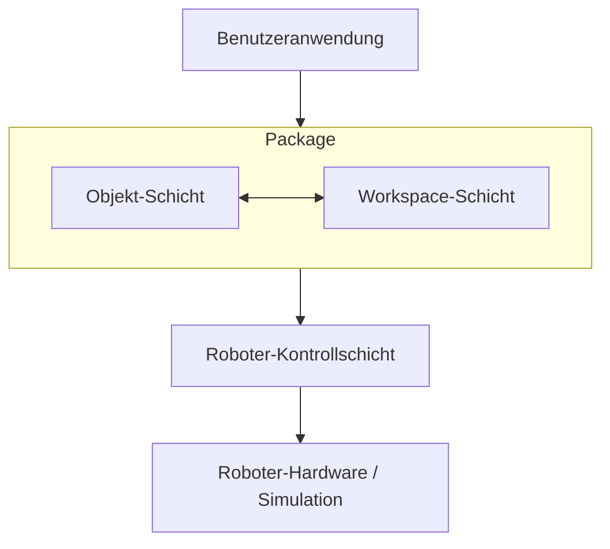

# Architektur-Dokumentation

Umfassende Dokumentation der Architektur, Entwurfsmuster und Implementierungsdetails des `robot_workspace`-Pakets.

## Systemarchitektur

Das `robot_workspace`-Paket trennt die Belange zwischen:

- **Objekt-Repräsentation**: Erkannte Objekte mit physikalischen Eigenschaften.
- **Workspace-Management**: Definitionen von Roboter-Workspaces und Koordinatentransformationen.
- **Räumliches Denken**: Abfragen und Beziehungen zwischen Objekten.

### Komponenten-Interaktion



## Koordinatensysteme

Das Paket verwendet drei verschiedene Koordinatensysteme:

1. **Bildkoordinaten (Pixel)**: (u, v) in Pixeln. Ursprung oben links.
2. **Relative Koordinaten (Normalisiert)**: (u_rel, v_rel) im Bereich [0, 1].
3. **Weltkoordinaten (Meter)**: (x, y, z) in Metern bezogen auf die Roboterbasis.

### Transformations-Pipeline

```
Bildkoordinaten (u, v)
         ↓
    [Normalisierung]
         ↓
Relative Koordinaten (u_rel, v_rel)
         ↓
    [Workspace.transform_camera2world_coords()]
         ↓
Weltkoordinaten (x, y, z, roll, pitch, yaw)
```

## Entwurfsmuster

- **Abstract Factory**: Für die Erstellung verschiedener Workspace-Typen (Niryo, WidowX).
- **Collection Pattern**: `Objects` als erweiterte Liste für räumliche Abfragen.
- **Serialization Pattern**: Konsistente JSON-Serialisierung über alle Objekte hinweg.
