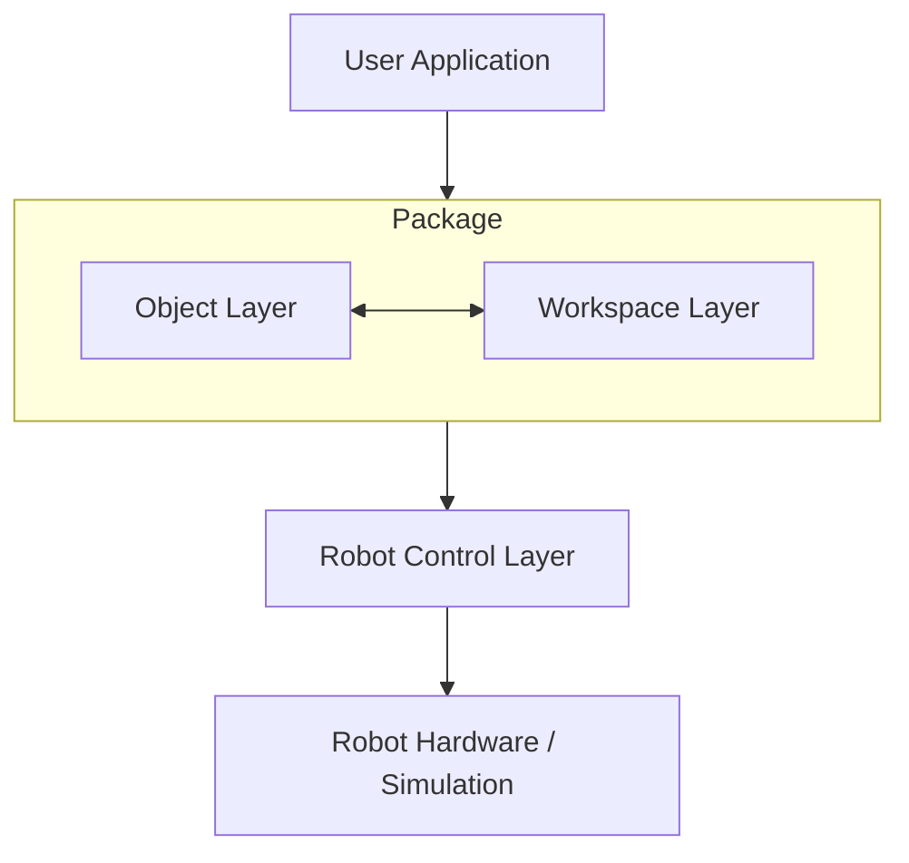

# Architecture Documentation

Comprehensive documentation for the architecture, design patterns, and implementation details of the `robot_workspace` package.

## System Architecture

The `robot_workspace` package separates concerns between:

- **Object Representation**: Detected objects with physical properties.
- **Workspace Management**: Robot workspace definitions and coordinate transformations.
- **Spatial Reasoning**: Queries and relationships between objects.

### Component Interaction



## Coordinate Systems

The package handles three distinct coordinate systems:

1. **Image Coordinates (Pixels)**: (u, v) in pixels. Origin at top-left.
2. **Relative Coordinates (Normalized)**: (u_rel, v_rel) in range [0, 1].
3. **World Coordinates (Meters)**: (x, y, z) in meters relative to robot base.

### Transformation Pipeline

```
Image Coordinates (u, v)
         ↓
    [Normalization]
         ↓
Relative Coordinates (u_rel, v_rel)
         ↓
    [Workspace.transform_camera2world_coords()]
         ↓
World Coordinates (x, y, z, roll, pitch, yaw)
```

## Design Patterns

- **Abstract Factory**: For creating different workspace types (Niryo, WidowX).
- **Collection Pattern**: `Objects` as an enhanced list for spatial queries.
- **Serialization Pattern**: Consistent JSON serialization across all objects.
